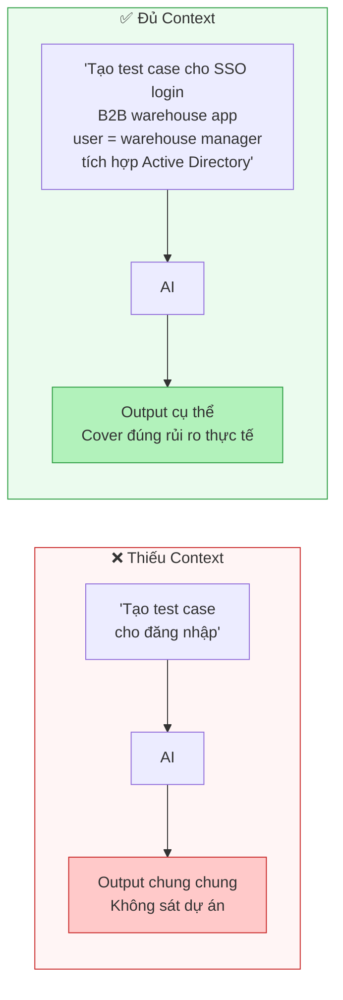
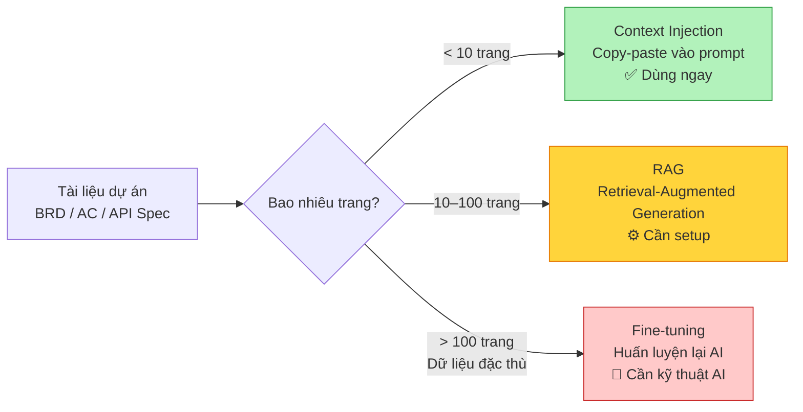

# Session 3 — Context: Biến AI hiểu dự án của bạn

> Bạn sẽ học cách cung cấp đúng bối cảnh để AI tạo ra output thực sự có giá trị cho dự án của bạn — không còn chung chung nữa. Đây là "mảnh ghép cuối" để hoàn thiện bộ ba Mindset–Technique–Context.

**Prerequisite:** [Session 2 — Technique](./session-02-technique.md)

## ✅ Mục tiêu — Sau session này bạn có thể

- [ ] Giải thích tại sao Context là "mảnh ghép cuối" để AI cho output có giá trị
- [ ] Áp dụng nguyên tắc GIGO vào việc chuẩn bị prompt
- [ ] Inject context dự án vào prompt một cách hiệu quả
- [ ] Hiểu khái niệm RAG và Fine-tuning ở mức ứng dụng (không cần code)
- [ ] Tạo Context Card cá nhân cho dự án đang làm

---

## PHẦN 1 — LÝ THUYẾT

### 1.1 Tại sao Context là nguyên tắc quan trọng nhất?

Sau khi học Mindset và Technique, nhiều Tester vẫn thấy AI trả về kết quả quá chung chung. Lý do chính: **THIẾU BỐI CẢNH**.

| Prompt thiếu context | Prompt đủ context |
|---------------------|-----------------|
| *"Tạo test case cho đăng nhập"* | *"Tạo test case cho chức năng SSO login của ứng dụng quản lý kho B2B, user là warehouse manager, hệ thống tích hợp với Active Directory"* |
| **Kết quả:** Generic, có thể dùng cho bất kỳ app nào | **Kết quả:** Cụ thể, cover đúng rủi ro thực tế của dự án |



---

### Quy tắc GIGO (Garbage In, Garbage Out)

```
┌─────────────────────────────────────────────────────────┐
│                                                         │
│  Prompt chung chung  →  Output nông cạn, vô dụng        │
│                                                         │
│  Prompt + Context    →  Output sâu, sát thực tế         │
│                                                         │
│       "Rác vào = Rác ra"  (GIGO)                        │
│                                                         │
└─────────────────────────────────────────────────────────┘
```

> **Nguyên tắc:** Context tốt = Dữ liệu đầu vào tốt = Output giá trị cao

---

### 1.2 Năm loại Context cần cung cấp cho AI

| Loại Context | Ví dụ cụ thể cho QA |
|-------------|-------------------|
| **Business domain** | Hệ thống ngân hàng / y tế / thương mại điện tử / logistics |
| **User persona** | Người dùng là ai, trình độ công nghệ, thói quen sử dụng |
| **Kỹ thuật / Công nghệ** | React frontend, Java Spring Boot, PostgreSQL, REST API |
| **Quy tắc nghiệp vụ** | Số tiền chuyển tối đa 500 triệu/ngày, thẻ hết hạn tự động hủy |
| **Lịch sử bug / Rủi ro** | Module thanh toán hay lỗi khi concurrent user > 100 |

```mermaid
mindmap
  root((Context Card\nDự án))
    Business Domain
      e-commerce / banking / healthcare
      Đặc thù ngành nghề
    User Persona
      Vai trò người dùng
      Trình độ công nghệ
      Thói quen sử dụng
    Tech Stack
      Frontend / Backend / Database
      API type: REST / GraphQL
    Business Rules
      Giới hạn số tiền, thời gian
      Quy định bắt buộc
      Điều kiện đặc biệt
    Lịch sử Bug & Rủi ro
      Module hay lỗi
      Rủi ro đã biết
      Pattern lỗi cũ
```



---

### 1.3 RAG và Fine-tuning — Giải thích cho non-tech

**RAG (Retrieval-Augmented Generation):**
AI được cung cấp tài liệu cụ thể **TRƯỚC KHI** trả lời. Giống như bạn cho nhân viên đọc tài liệu nội bộ trước khi làm việc.

**Fine-tuning:**
"Huấn luyện lại" AI với dữ liệu của công ty. Phức tạp hơn, cần kỹ thuật, nhưng kết quả rất đặc thù. Phù hợp khi có nhiều tài liệu nội bộ.

| Phương pháp | Độ khó | Khi nào dùng |
|------------|--------|-------------|
| **Context injection** *(Session này)* | Dễ — chỉ cần copy-paste | Ngay lập tức, mọi dự án |
| **RAG** | Trung bình — cần setup | Có nhiều tài liệu nội bộ (> 50 trang) |
| **Fine-tuning** | Khó — cần kỹ thuật AI | Khi cần AI hiểu sâu nghiệp vụ đặc thù |



---

### 📺 Video tham khảo — RAG: Cách cung cấp tài liệu nội bộ cho AI

> **"Learn RAG from Scratch"** — freeCodeCamp (Lance Martin, LangChain engineer) · 2.5 giờ · Tiếng Anh

<iframe width="100%" height="380" src="https://www.youtube.com/embed/sVcwVQRHIc8" title="Learn RAG from Scratch – Python AI Tutorial" frameborder="0" allow="accelerometer; autoplay; clipboard-write; encrypted-media; gyroscope; picture-in-picture" allowfullscreen></iframe>

> Giải thích sâu về RAG (Retrieval-Augmented Generation): indexing, query translation, CRAG, Adaptive RAG. Hữu ích cho ai muốn hiểu cách AI "đọc" tài liệu nội bộ của dự án.

---

## PHẦN 2 — THỰC HÀNH

### 🛠️ Bài tập 3.1 — Context Injection với tài liệu thực tế

> **Thời gian ước tính:** 40 phút | **Công cụ:** ChatGPT hoặc Claude.ai

**Bước 1:** Chuẩn bị một đoạn tài liệu từ dự án thực tế của bạn — chọn một trong các loại sau:
- User story / Acceptance criteria (1–2 story là đủ)
- Một endpoint từ API documentation (Swagger/Postman)
- Một đoạn ngắn từ Business requirement document (BRD) — tối đa 2000 ký tự

Nếu chưa có dự án thực tế, dùng đoạn mẫu bên dưới:

```
User Story: Là khách hàng, tôi muốn chuyển tiền cho tài khoản khác
trong cùng ngân hàng. Số tiền tối thiểu: 10,000 VND. Số tiền tối đa:
500,000,000 VND/ngày. Tài khoản nguồn phải có đủ số dư. Giao dịch
thành công sẽ hiển thị thông báo xác nhận và gửi SMS.
```

**Bước 2:** Chạy prompt KHÔNG có context trước (để so sánh sau):

```
Tạo test case cho chức năng chuyển tiền
```

Ghi lại output vào notes.

**Bước 3:** Chạy prompt CÓ context, dùng template sau:

```
=== CONTEXT ===
[Paste nội dung tài liệu bạn đã chuẩn bị ở Bước 1]
=== HẾT CONTEXT ===

Dựa trên tài liệu trên, hãy:
1. Xác định 5 rủi ro kiểm thử chính
2. Tạo 10 test case ưu tiên cao nhất
3. Đề xuất test data cần chuẩn bị
```

**Bước 4:** So sánh hai output và điền vào bảng đánh giá bên dưới.

**✅ Kết quả mong đợi:**
> Output có context sẽ đề cập đúng các con số từ tài liệu (10,000 VND, 500 triệu/ngày), cover các edge case nghiệp vụ thực tế (số dư không đủ, vượt hạn mức ngày), và gợi ý test data phù hợp. Output không có context sẽ chung chung, không đề cập đặc thù nào của hệ thống.

**❓ Tự kiểm tra — Bảng đánh giá** (chấm điểm 1–5 cho mỗi tiêu chí):

| Tiêu chí | Không context | Có context | Cải thiện |
|---------|:-------------:|:----------:|:---------:|
| Độ cụ thể (sát business domain?) | ___/5 | ___/5 | +___% |
| Khả năng dùng ngay (cần sửa nhiều không?) | ___/5 | ___/5 | +___% |
| Coverage (cover đúng rủi ro đặc thù?) | ___/5 | ___/5 | +___% |

💡 **Gợi ý khi bị kẹt:** Nếu tài liệu của bạn quá dài (> 2000 ký tự), hãy tóm tắt thủ công trước — lấy các business rule quan trọng nhất, con số giới hạn, và mô tả actor chính.

---

### 🛠️ Bài tập 3.2 — Domain-Specific Test Data

> **Thời gian ước tính:** 40 phút | **Công cụ:** ChatGPT hoặc Claude.ai

**Bối cảnh bài tập:**

Test data chung chung không cover được đặc thù domain. Đây là ví dụ minh họa:

```
❌ Prompt thiếu context:
"Tạo test data cho hệ thống ngân hàng"
→ AI tạo: tên = "John Doe", số tài khoản = "123456" (vô nghĩa)

✅ Prompt đủ context:
"Tạo test data cho hệ thống ngân hàng Việt Nam theo quy định SBV.
Yêu cầu:
- Số tài khoản: 14 chữ số, bắt đầu bằng mã ngân hàng (VCB: 0070, TCB: 019)
- Số CMND/CCCD: 9 hoặc 12 chữ số, khớp với tỉnh thành
- Số tiền: VND, không có số thập phân, tối thiểu 50,000 VND
- Tên khách hàng: tên Việt Nam có dấu, format Họ Tên đệm

Tạo 10 dòng data hợp lệ và 5 dòng data lỗi để test validation."
→ AI tạo dữ liệu thực tế, đúng chuẩn Việt Nam
```

**Bước 1:** Chọn domain phù hợp với dự án của bạn (hoặc chọn bất kỳ domain nào bên dưới nếu chưa có dự án thực):

| Domain | Test data cần tạo |
|--------|------------------|
| **E-commerce** | Sản phẩm, giỏ hàng, voucher, vận chuyển |
| **HR System** | Nhân viên, lương, ngày phép, bảo hiểm |
| **Healthcare** | Bệnh nhân, lịch khám, đơn thuốc, BHYT |
| **Logistics** | Đơn hàng, tuyến đường, kho hàng, tài xế |
| **Finance** | Tài khoản, giao dịch, hạn mức, phí |

**Bước 2:** Nghiên cứu (hoặc ghi lại từ kiến thức của bạn) ít nhất 3–4 quy tắc đặc thù của domain đó. Ví dụ với Healthcare: định dạng mã bệnh nhân, tên thuốc theo chuẩn ICD, định dạng số BHYT.

**Bước 3:** Viết prompt yêu cầu AI tạo test data với đầy đủ quy tắc domain bạn đã nghiên cứu.

**Bước 4:** Chạy prompt và đánh giá: data có phù hợp với thực tế của domain đó không?

**Output mục tiêu:** 15 dòng data hợp lệ + 5 dòng edge case + 5 dòng data lỗi

**✅ Kết quả mong đợi:**
> Data AI tạo ra phải trông như data thật — đúng format, đúng quy tắc, có thể dùng ngay để test mà không cần sửa nhiều. Nếu bạn thấy data trông "giả" hoặc sai quy tắc thực tế, nghĩa là prompt của bạn chưa đủ context về domain.

**❓ Tự kiểm tra:**
- [ ] Data có đúng format đặc thù của domain không? (số tài khoản, mã bệnh nhân, mã sản phẩm...)
- [ ] Data lỗi có cover đúng các validation rule của hệ thống không?
- [ ] Bạn có thể dùng data này để test ngay không, hay cần sửa nhiều?

💡 **Gợi ý khi bị kẹt:** Nếu không biết quy tắc domain, hãy hỏi AI trước: *"Hệ thống [domain] Việt Nam thường có những quy tắc validate dữ liệu nào?"* — sau đó dùng thông tin đó để viết prompt tạo test data.

---

### 💡 TÌNH HUỐNG THỰC TẾ: "Tài liệu quá dài, AI quên context"

**Bối cảnh:**
Hương là QA Lead. Cô paste cả 50-trang BRD vào ChatGPT để sinh test plan. Khi hỏi đến module cuối, AI bắt đầu "quên" thông tin ở module đầu. Test plan tạo ra bị thiếu sót nhiều phần quan trọng.

**Bài tập:** Ghi lại câu trả lời của bạn vào notes — không có đáp án duy nhất, miễn là bạn có thể giải thích lý do.

1. Nguyên nhân kỹ thuật là gì? *(Gợi ý: "context window")*
2. Chiến lược nào giúp xử lý tài liệu dài?
3. Nếu bạn là Hương, bạn sẽ làm gì khác đi?
4. Khi nào nên dùng RAG thay vì context injection?

> **Gợi ý giải:** ChatGPT ~128K token, Claude ~200K token (1 token ≈ 4 ký tự). Tài liệu 50 trang ≈ 75K+ token — đã gần limit. **Giải pháp:** Chia tài liệu theo module, xử lý từng phần riêng biệt, tổng hợp sau.

---

### 🛠️ Bài tập 3.3 — Xây dựng Context Card cá nhân

> **Thời gian ước tính:** 20 phút | **Công cụ:** Notion / Google Doc / bất kỳ ứng dụng ghi chú nào

Bài tập này tạo ra một tài sản bạn sẽ dùng lại mãi mãi: **Context Card** cho dự án của bạn.

**Bước 1:** Tạo một file mới. Đặt tên: `Context Card — [Tên dự án của bạn]`.

**Bước 2:** Điền đầy đủ template sau. Nếu chưa có dự án thực tế, hãy dùng dự án mẫu: ứng dụng e-commerce bán hàng thời trang online.

```markdown
## Context Card — [Tên dự án]

### Domain
[Lĩnh vực: e-commerce / banking / healthcare / ...]

### Tech Stack
- Frontend: [React / Angular / Vue / ...]
- Backend: [Java Spring / Node.js / Python / ...]
- Database: [PostgreSQL / MySQL / MongoDB / ...]
- API: [REST / GraphQL / ...]

### User chính
- Vai trò: [Admin / End-user / Manager / ...]
- Trình độ công nghệ: [Cao / Trung bình / Thấp]
- Đặc điểm: [...]

### Business rules quan trọng
- [Quy tắc 1]
- [Quy tắc 2]
- [Quy tắc 3]

### Các loại lỗi hay gặp
- [Vấn đề 1]
- [Vấn đề 2]

### Đặc điểm dữ liệu
- Format số, ngày tháng, tiền tệ: [...]
- Giới hạn, ràng buộc: [...]
```

**Bước 3:** Sau khi điền xong, copy toàn bộ Context Card và paste vào đầu bất kỳ prompt nào bạn đã tạo ở Session 2. Chạy thử và so sánh với phiên bản không có Context Card.

**✅ Kết quả mong đợi:**
> Context Card điền đầy đủ sẽ khiến mọi prompt của bạn cho output tốt hơn ngay lập tức — không cần giải thích lại từ đầu mỗi lần. Đây là kỹ thuật tiết kiệm thời gian nhất trong session này.

**❓ Tự kiểm tra:**
- [ ] Context Card có đủ 6 mục không?
- [ ] Business rules có ít nhất 3 quy tắc cụ thể không?
- [ ] Khi copy vào prompt, output có cụ thể và sát dự án hơn không?

💡 **Gợi ý khi bị kẹt:** Phần khó nhất thường là "Business rules quan trọng" vì nó đòi hỏi bạn hiểu rõ domain. Nếu chưa chắc, hãy hỏi AI: *"Hệ thống [domain] thường có những business rule phổ biến nào?"* rồi chỉnh lại cho phù hợp với dự án thực tế của bạn.

---

## PHẦN 3 — TỰ ĐÁNH GIÁ

### 📋 "Context Detective"

Dưới đây là 3 output AI tạo ra. Nhiệm vụ của bạn: phân tích context nào đã được cung cấp (hay thiếu). Ghi câu trả lời vào notes của bạn.

---

**Output 1:**
```
Test case: Đăng nhập với email "user123@email.com", password "Test@1234"
Expected: Đăng nhập thành công
```
- Context nào có mặt? `_______________`
- Context nào đang thiếu? `_______________`
- Chất lượng: ___/10

---

**Output 2:**
```
Test case: Kiểm tra chuyển tiền với số tiền "1,000,000 VND"
Số tài khoản nguồn: "0070123456789012" (VCB)
Expected: Giao dịch thành công, số dư giảm đúng
```
- Context nào có mặt? `_______________`
- Tốt hơn Output 1 ở điểm nào? `_______________`
- Vẫn còn thiếu context gì? `_______________`

---

**Output 3:**
```
API Test: POST /api/v1/orders/cancel
Payload: {
  "orderId": "ORD-2024-001",
  "reason": "customer_request",
  "cancelledBy": "user_id_123"
}
Expected: 200 OK, order status = "cancelled"
```
- Context nào có mặt? `_______________`
- Còn thiếu context gì để test tốt hơn? `_______________`

💡 **Gợi ý khi bị kẹt:** Nhớ lại 5 loại context từ Phần 1: Business domain, User persona, Tech stack, Business rules, Lịch sử bug. Với mỗi output, hỏi: "Loại context nào được phản ánh trong output này? Loại nào không?"

---

## 📝 Tổng kết

1. ✅ **Context = chất lượng output:** Thiếu context ⇒ output vô dụng
2. ✅ **5 loại context:** Domain, User, Tech, Business rules, Lịch sử lỗi
3. ✅ **GIGO:** Garbage In = Garbage Out — đây là nguyên tắc bất biến của AI
4. ✅ **RAG** dùng khi có nhiều tài liệu nội bộ; **Fine-tuning** khi cần AI "hiểu" sản phẩm
5. ✅ **Context Card** cho dự án — copy vào mỗi prompt để output tốt hơn ngay

---

## 🗒️ Cheat Sheet

```
Template context:
  [Domain] + [User] + [Tech stack] + [Business rules] + [Constraints]

Gợi ý: Copy 1 đoạn từ BRD / AC vào prompt trước khi yêu cầu sinh test case

Context window limits:
  ChatGPT: ~128K token   Claude: ~200K token   (1 token ≈ 4 ký tự)

Tài liệu dài: Chia theo module, xử lý từng phần, tổng hợp sau

Context Card: Tạo 1 lần, dùng mãi mãi cho dự án của bạn
```

---

## 📚 Bài tập về nhà

> Tạo **Context Card** cho dự án hiện tại.
> Test với 5 prompt khác nhau: So sánh output có/không có Context Card.
> Đo lường: Tiết kiệm bao nhiêu thời gian chỉnh sửa output?

---

*⬅️ [Session 2 — Technique](./session-02-technique.md) · ➡️ [Session 4 — Skill Building](./session-04-skill-building.md)*
