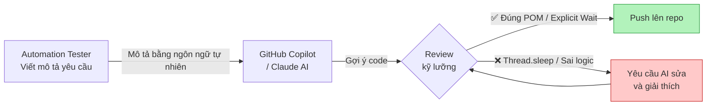
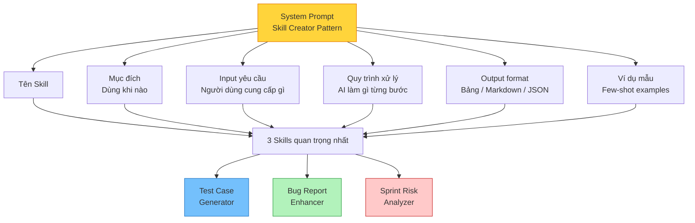

# Session 4 — Skill Building: Automation với AI

> Trong session này, bạn sẽ học cách dùng GitHub Copilot để viết automation script nhanh hơn và xây dựng các "skill" tái sử dụng với Claude — giúp bạn tiết kiệm thời gian lặp lại mỗi ngày trong công việc QA thực tế.

## ✅ Mục tiêu — Sau session này bạn có thể

- [ ] Viết automation script Selenium / Playwright với sự hỗ trợ của GitHub Copilot
- [ ] Tạo REST Assured / Postman test với AI
- [ ] Hiểu khái niệm Skill trong Claude và cách xây dựng custom skill cho QA
- [ ] Xây dựng 3 skill tái sử dụng được trong thực tế

---

## PHẦN 1 — LÝ THUYẾT

### 1.1 GitHub Copilot cho Automation Tester

Copilot là AI coding assistant tích hợp trực tiếp vào IDE (VS Code, IntelliJ). Nó hiểu ngôn ngữ lập trình và có thể:

- Tạo script Selenium / Playwright từ mô tả ngôn ngữ tự nhiên
- Gợi ý code completion khi bạn đang viết
- Giải thích đoạn code bạn không hiểu
- Refactor code test để dễ bảo trì hơn
- Tạo Page Object Model từ HTML snippet

### 📺 Video tham khảo — Dùng AI để lập trình nhanh hơn

> **"How to Code Using AI – ChatGPT Programming Tutorial"** — freeCodeCamp (Guil Hernandez) · 5 giờ · Tiếng Anh

<iframe width="100%" height="380" src="https://www.youtube.com/embed/dJhlMn2otxA" title="How to Code Using AI – ChatGPT Programming Course" frameborder="0" allow="accelerometer; autoplay; clipboard-write; encrypted-media; gyroscope; picture-in-picture" allowfullscreen></iframe>

> Khóa học toàn diện về cách dùng ChatGPT/AI để viết và debug code. Phù hợp cho cả Manual Tester muốn học automation lẫn Automation Engineer muốn tăng tốc.

---

| Viết thủ công (trước AI) | Viết với Copilot (sau AI) |
|------------------------|--------------------------|
| 30–60 phút cho 1 test script cơ bản | 5–15 phút cho script tương tự |
| Phải nhớ syntax chính xác | Copilot gợi ý, bạn chỉ cần chọn |
| Debug tự mình | Copilot giải thích lỗi và gợi ý fix |
| POM phải viết tay | Copilot tạo POM từ HTML snippet |



---

### 1.2 Xây dựng Skill với Claude — Khái niệm

**Claude Skill** là các "công thức" được cấu hình sẵn, giúp AI trả về output nhất quán, có cấu trúc, và đúng với dự án của bạn.

Thay vì viết lại prompt dài mỗi lần, bạn chỉ cần gọi tên skill.

| Loại Skill QA | Mục đích |
|--------------|---------|
| **Test Case Generator** | Sinh test case theo template chuẩn của team |
| **Bug Report Enhancer** | Biến bug report sơ sài thành báo cáo chuyên nghiệp |
| **Test Data Factory** | Tạo test data theo đúng domain và quy tắc nghiệp vụ |
| **Script Reviewer** | Review và gợi ý cải tiến automation script |
| **Risk Analyzer** | Đánh giá rủi ro sprint trước khi release |



---

### 1.3 Cấu trúc một Skill — Skill Creator Pattern

```markdown
## Tên Skill: [Tên rõ ràng, ngắn gọn]

## Mục đích:
[Mô tả skill này làm gì, dùng khi nào]

## Input yêu cầu:
[Người dùng cần cung cấp gì?]

## Quy trình xử lý:
[AI sẽ làm gì với input đó? Từng bước]

## Output format:
[Định dạng kết quả cụ thể — bảng, markdown, JSON, ...]

## Ví dụ mẫu (few-shot):
[1–2 ví dụ input → output mong muốn]

## Lưu ý / Ràng buộc:
[Những điều AI phải / không được làm]
```

---

## PHẦN 2 — THỰC HÀNH

### 🛠️ Bài tập 4.1 — Automation Script với AI

> **Thời gian ước tính:** 40 phút | **Công cụ:** Claude.ai hoặc GitHub Copilot, VS Code

> **🎯 Lộ trình theo role — đọc trước khi bắt đầu:**
>
> | Role | Làm gì trong bài tập này |
> |------|--------------------------|
> | **Automation Engineer / QA Lead** | Làm đầy đủ Bước 1–5, bao gồm chạy script trong IDE |
> | **Manual Tester / BA** | Làm Bước 1–4 (tạo prompt, đọc code, review checklist). **Bỏ qua Bước 5.** Mục tiêu của bạn là biết cách ra yêu cầu cho AI và đánh giá chất lượng output — không phải tự chạy code. |
> | **PO / QA Manager** | Đọc qua Bước 2–3 để hiểu AI tạo code như thế nào. Tập trung vào checklist review ở Bước 3 — đây là góc nhìn bạn cần khi sign-off automated test suite. |
>
> 💡 **Tại sao Manual Tester vẫn nên làm bài tập này?** Xu hướng 2025: ranh giới giữa manual và automation đang mờ dần. Biết cách đọc và đánh giá script AI tạo ra — dù không tự code — là kỹ năng ngày càng được yêu cầu trong JD của senior manual tester.

**Bước 1:** Mở Claude.ai (hoặc Copilot trong VS Code). Tạo một cuộc hội thoại mới.

**Bước 2:** Paste prompt sau vào Claude:

```
Tạo Selenium WebDriver test (Java, TestNG) cho tính năng đăng nhập.
URL: https://the-internet.herokuapp.com/login

Test cases cần cover:
1. Đăng nhập thành công (user: tomsmith / pass: SuperSecretPassword!)
2. Sai mật khẩu (user: tomsmith / pass: wrongpass)
3. Bỏ trống cả hai trường

Yêu cầu kỹ thuật:
- Sử dụng Page Object Model (tách LoginPage riêng)
- Dùng Explicit Wait, KHÔNG dùng Thread.sleep
- Thêm Assert kiểm tra message thông báo
- TestNG annotations: @Test, @BeforeMethod, @AfterMethod
```

**Bước 3:** Đọc kỹ code AI tạo ra. Dùng checklist sau để review — đánh dấu ✅ đã / ❌ chưa:

```
[ ] Page Object Model có tách biệt khỏi test logic?
[ ] Có Explicit Wait thay vì Thread.sleep?
[ ] Assert message có chính xác?
[ ] Test data có bị hard-code trong test method?
[ ] Có thể chạy độc lập không? (Test isolation)
[ ] Tên biến, phương thức có rõ ràng, dễ hiểu?
[ ] @BeforeMethod và @AfterMethod có setup/teardown đúng?
```

**Bước 4:** Nếu phát hiện vấn đề, hỏi AI để sửa. Ví dụ: *"Đoạn này đang dùng Thread.sleep — hãy thay bằng Explicit Wait đúng cách."*

**Bước 5:** Nếu có thể, chạy thử script trong IDE và xem kết quả.

**✅ Kết quả mong đợi:**
> Script gồm ít nhất 2 file: `LoginPage.java` (Page Object) và `LoginTest.java` (test methods). File `LoginPage.java` chứa các WebElement và action methods. File `LoginTest.java` chứa 3 `@Test` methods dùng `WebDriverWait` (không có `Thread.sleep`), mỗi test có assertion kiểm tra text thông báo trên trang.

**❓ Tự kiểm tra:**
- [ ] Code AI tạo có dùng POM đúng cách không?
- [ ] Nếu bạn là Manual Tester, bạn có thể giải thích logic từng test method không (dù không tự code được)?
- [ ] Bạn có thể nhận ra điểm nào cần cải thiện trong script này không?

💡 **Gợi ý khi bị kẹt:** Nếu không quen với Java/Selenium, dùng AI để giải thích từng dòng code — nhập vào chat: *"Giải thích đoạn code này làm gì, từng dòng một."* Bạn không cần biết code để hiểu output và đánh giá chất lượng.

---

### 🛠️ Bài tập 4.2 — Xây dựng 3 Custom Skills

> **Thời gian ước tính:** 60 phút | **Công cụ:** Claude.ai (Projects hoặc system prompt)

#### SKILL 1: Test Case Generator

> **Thời gian ước tính:** 20 phút

**Bước 1:** Mở Claude.ai. Vào **Projects** (nếu có) hoặc bắt đầu cuộc hội thoại mới.

**Bước 2:** Dùng đoạn sau làm system prompt (hoặc paste vào đầu cuộc hội thoại):

```
Bạn là Test Case Generator chuyên nghiệp.

THÔNG TIN DỰ ÁN:
[Paste Context Card của bạn từ Session 3 vào đây]

KHI NHẬN ĐƯỢC USER STORY, BẠN SẼ:
1. Phân tích acceptance criteria
2. Tạo test case theo format:
   TC-ID | Loại | Mô tả | Precondition | Steps | Expected | Priority
3. Bao gồm: Happy path, Negative cases, Boundary values, Edge cases
4. Xếp loại Priority: P1 (critical), P2 (high), P3 (medium)
5. Ưu tiên những rủi ro đặc thù của [DOMAIN DỰ ÁN]

RÀNG BUỘC:
- Không tạo test case chung chung, không liên quan đến domain
- Luôn hỏi nếu thiếu thông tin quan trọng
- Tối thiểu 8 test case cho mỗi user story
```

**Bước 3:** Paste 1 User Story thực tế từ dự án của bạn vào (hoặc dùng ví dụ: *"Người dùng có thể thêm sản phẩm vào wishlist. Wishlist lưu tối đa 50 sản phẩm."*) và gửi đi.

**Bước 4:** Đọc kết quả — đánh giá xem test case có đủ happy path, negative, boundary không.

**✅ Kết quả mong đợi:**
> Một bảng Markdown với ít nhất 8 test case, mỗi dòng có đủ TC-ID, Loại (Happy/Negative/Boundary), Mô tả ngắn gọn, Steps và Expected result rõ ràng. Với wishlist, test case phải bao gồm: thêm sản phẩm thành công, thêm khi đã đủ 50 sản phẩm (boundary), thêm sản phẩm trùng lặp, thêm khi chưa đăng nhập.

💡 **Gợi ý khi bị kẹt:** Nếu AI tạo test case quá chung chung, thêm vào prompt: *"Tập trung vào rủi ro đặc thù của [domain] — ví dụ [1 rủi ro cụ thể]."*

---

#### SKILL 2: Bug Report Enhancer

> **Thời gian ước tính:** 20 phút

**Bước 1:** Mở một cuộc hội thoại mới trong Claude.ai.

**Bước 2:** Paste system prompt sau:

```
Bạn là QA Technical Writer chuyên nghiệp.

KHI NHẬN ĐƯỢC BUG DESCRIPTION SƠ SÀI, BẠN SẼ:
1. Thêm tiêu đề rõ ràng: [Module] - [Vấn đề ngắn gọn]
2. Viết lại Steps to Reproduce chi tiết (đánh số, cụ thể)
3. Phân biệt rõ: Actual result vs Expected result
4. Đề xuất: Severity (Critical/High/Medium/Low) và Priority với lý do
5. Gợi ý: Attachments / evidence cần có
6. Thêm Environment info nếu chưa có

RÀNG BUỘC:
- Giữ nguyên ngôn ngữ gốc (Việt/Anh), chỉ làm rõ và thêm thông tin
- Không bịa thêm thông tin không có trong bug description gốc
- Nếu thiếu thông tin quan trọng, đánh dấu [CẦN XÁC NHẬN]
```

**Bước 3:** Paste 1 bug report sơ sài (của bạn hoặc ví dụ dưới đây) vào:

```
Nút thanh toán bị lỗi khi dùng voucher. Tổng tiền tính sai.
```

**Bước 4:** Đọc bug report được AI làm đẹp. So sánh với bản gốc — cái gì được thêm vào, cái gì bị đánh dấu [CẦN XÁC NHẬN]?

**✅ Kết quả mong đợi:**
> Bug report được cải thiện gồm: tiêu đề dạng *"[Checkout] - Tổng tiền tính sai khi áp dụng voucher"*, các bước tái hiện được đánh số cụ thể (mở app → thêm sản phẩm → nhập voucher → xem tổng tiền), phần Actual vs Expected rõ ràng, Severity được đề xuất là High với lý do *"ảnh hưởng trực tiếp đến luồng thanh toán"*, và ít nhất 1 mục [CẦN XÁC NHẬN] cho thông tin còn thiếu.

**❓ Tự kiểm tra:**
- [ ] AI có bịa thêm thông tin không có trong mô tả gốc không?
- [ ] Mục [CẦN XÁC NHẬN] có hợp lý không?
- [ ] Bug report sau khi cải thiện có đủ để dev tái hiện lỗi không?

---

#### SKILL 3: Sprint Risk Analyzer

> **Thời gian ước tính:** 20 phút

**Bước 1:** Mở một cuộc hội thoại mới trong Claude.ai.

**Bước 2:** Paste system prompt sau:

```
Bạn là QA Risk Analyst có kinh nghiệm.

KHI NHẬN ĐƯỢC DANH SÁCH THAY ĐỔI TRONG SPRINT, BẠN SẼ PHÂN TÍCH VÀ TRẢ VỀ:

1. **Top 5 rủi ro kiểm thử** (sắp xếp theo mức độ)
2. **Các tính năng có thể bị ảnh hưởng ngoài ý muốn** (regression risk)
3. **Đề xuất thứ tự test** nếu ít thời gian
4. **Flag** những thay đổi nào cần QA Lead review đặc biệt

FORMAT OUTPUT — Bảng Markdown:
| Rủi ro | Mức độ | Lý do | Hành động đề xuất |
|--------|--------|-------|------------------|

RÀNG BUỘC:
- Tập trung vào rủi ro có thể xảy ra, không phải lý thuyết
- Ưu tiên business impact cao
- Nếu không đủ thông tin, hỏi thêm trước khi phân tích
```

**Bước 3:** Paste changelogs hoặc sprint notes thực tế. Nếu chưa có, dùng ví dụ:

```
Sprint 23 thay đổi:
- Thêm 2FA cho màn hình đăng nhập
- Cập nhật logic tính giá khi dùng voucher kết hợp giảm giá thành viên
- Fix bug: giỏ hàng không lưu khi session hết hạn
- Nâng cấp thư viện xử lý thanh toán từ v2.1 lên v3.0
```

**Bước 4:** Đọc kết quả phân tích rủi ro. Bạn có đồng ý với thứ tự ưu tiên không? Ghi lại quan điểm của bạn.

**✅ Kết quả mong đợi:**
> Một bảng Markdown với ít nhất 5 rủi ro được xếp hạng. Với ví dụ trên, rủi ro cao nhất nên là: nâng cấp thư viện thanh toán (v3.0 có thể có breaking changes), logic voucher kết hợp với giảm giá thành viên (nhiều case phức tạp), và 2FA (ảnh hưởng toàn bộ luồng đăng nhập). Mỗi rủi ro có hành động đề xuất cụ thể.

**❓ Tự kiểm tra:**
- [ ] AI có bỏ sót rủi ro nào quan trọng mà bạn nghĩ đến không?
- [ ] Thứ tự ưu tiên có phù hợp với dự án thực tế của bạn không?
- [ ] Bạn có thể dùng output này để trình bày với QA Lead không?

💡 **Gợi ý khi bị kẹt:** Nếu AI cho ra phân tích quá chung chung, thêm thông tin về domain: *"Đây là ứng dụng thương mại điện tử với 100.000 đơn/ngày — ưu tiên rủi ro ảnh hưởng đến thanh toán."*

---

### 💡 TÌNH HUỐNG THỰC TẾ 4: "Copilot gợi ý code sai"

**Bối cảnh:**
Hoàng là Automation Engineer. Anh dùng Copilot để viết test cho API. Copilot gợi ý dùng `Thread.sleep(3000)` để chờ element load. Hoàng nhận Copilot suggestion và push lên. CI pipeline pass.

Sau 2 tuần, team thấy test **flaky** — lúc pass lúc fail không rõ lý do.

**Ghi lại câu trả lời của bạn vào notes — không có đáp án duy nhất, miễn là bạn có thể giải thích lý do:**

1. Lỗi kỹ thuật cụ thể là gì với `Thread.sleep`?
2. Mindset nào của Hoàng bị thiếu?
3. Dùng AI để viết lại đoạn code dùng Explicit Wait thay thế.
4. Nên thêm quy tắc gì vào checklist review script để tránh lặp lại?

---

## PHẦN 3 — TỰ ĐÁNH GIÁ

### 📋 Bài tập tự đánh giá: So sánh 3 cách tạo test case

**Mục tiêu:** Tự trải nghiệm sự khác biệt giữa prompt thường và skill được cấu hình sẵn.

**Bước 1:** Lấy User Story sau (hoặc thay bằng user story thực tế của bạn):

> *"Người dùng có thể thêm sản phẩm vào wishlist. Wishlist lưu tối đa 50 sản phẩm."*

**Bước 2:** Thực hiện lần lượt 3 cách sau và ghi lại thời gian + số test case tạo ra:

| Cách | Làm như thế nào | Thời gian | Số TC | Chất lượng (tự đánh giá 1–5) |
|------|----------------|-----------|-------|------------------------------|
| **Cách 1** | Prompt thường: *"Tạo test case cho user story này"* | | | |
| **Cách 2** | Dùng Skill Test Case Generator đã xây dựng (không có Context Card) | | | |
| **Cách 3** | Dùng Skill + thêm Context Card của dự án | | | |

**Bước 3:** Tự trả lời các câu hỏi sau vào notes:

- Cách nào ra kết quả nhanh nhất? Nhanh hơn bao nhiêu?
- Cách nào ra kết quả chất lượng nhất? Vì sao?
- Skill có thay đổi kết quả so với prompt thường không? Thay đổi ở điểm nào?
- Context Card có làm tăng chất lượng không? Tăng ở điểm nào cụ thể?

**✅ Kết quả mong đợi:**
> Cách 3 (Skill + Context Card) thường cho ra test case có domain-specific risks hơn (ví dụ: boundary 50 sản phẩm, wishlist khi chưa đăng nhập, sản phẩm hết hàng trong wishlist). Cách 1 thường cho ra test case chung chung hơn và ít edge case hơn. Chênh lệch thời gian giữa cách 1 và cách 3 thường không nhiều — giá trị chính là ở chất lượng.

---

## 📝 Tổng kết

1. ✅ **Copilot / AI giảm 70% thời gian viết script** — nhưng vẫn cần review kỹ
2. ✅ **Skill = Prompt đã được cấu hình sẵn** — tiết kiệm thời gian, tăng nhất quán
3. ✅ **Skill Creator pattern:** Tên + Mục đích + Input + Quy trình + Output + Ví dụ
4. ✅ **3 skill có giá trị nhất:** Test Gen + Bug Enhancer + Risk Analyzer
5. ✅ **AI gợi ý code sai** — luôn review trước khi chạy, đặc biệt với CI/CD

---

## 🗒️ Cheat Sheet

```
Copilot: Viết comment mô tả yêu cầu, Copilot tự viết code

Selenium prompt:
  "Dùng POM, Explicit Wait, TestNG, KHÔNG dùng Thread.sleep"

Playwright prompt:
  "Dùng async/await, locators chuẩn (getByRole/getByText), assertions rõ ràng"

Skill lưu ở đâu:
  → Claude Projects (system prompt)
  → Notion page
  → File .md trong repo: /docs/ai-skills/

Review checklist script AI:
  POM ✓ | Explicit Wait ✓ | Assert ✓ | No hardcode ✓ | Isolated ✓
```

---

## 📚 Bài tập về nhà

> Tạo thêm **2 skill mới** cho công việc QA hằng ngày của bạn.
> Lưu skill vào file `.md` trong repo hoặc Claude Projects, dùng thử trong 1 tuần và ghi lại: skill đó tiết kiệm được bao nhiêu thời gian? Cần cải thiện gì?

---

*⬅️ [Session 3 — Context](./session-03-context.md) · ➡️ [Session 5 — AI Agent](./session-05-ai-agent.md)*
