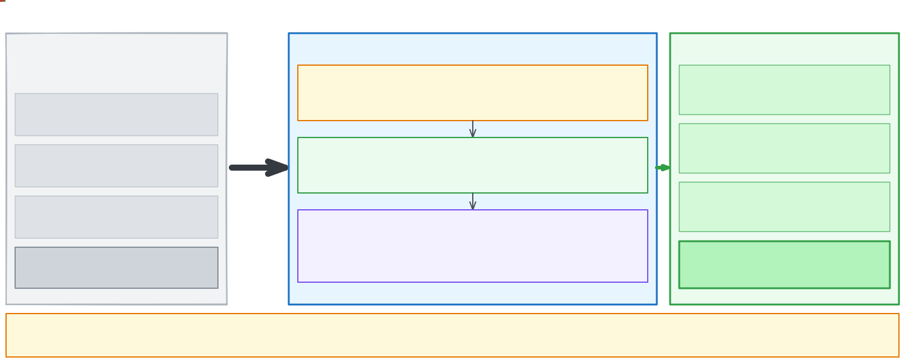
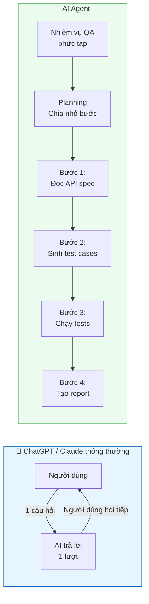
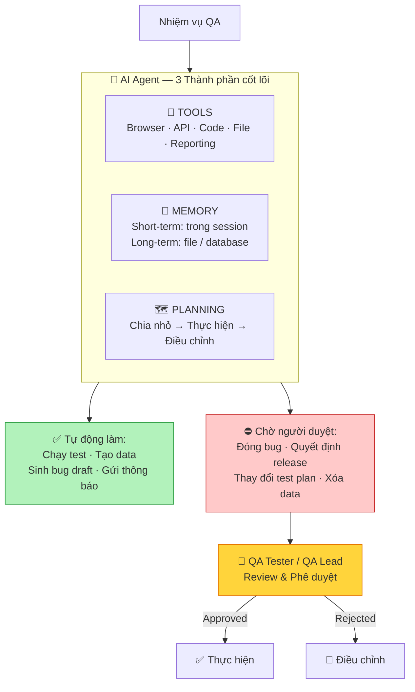

# Session 5 — AI Agent: Từ trợ lý đến Tester tự động

> Trong session này, bạn sẽ hiểu AI Agent là gì và khác ChatGPT thông thường như thế nào — rồi tự tay thiết kế một QA Agent đơn giản có thể tự động hóa các bước lặp đi lặp lại trong công việc kiểm thử của bạn.

## ✅ Mục tiêu — Sau session này bạn có thể

- [ ] Giải thích AI Agent là gì và khác ChatGPT thông thường như thế nào
- [ ] Mô tả 3 thành phần cốt lõi của Agent: Tools, Memory, Planning
- [ ] Phân biệt rõ AI Agent (đơn lẻ) và Agentic AI (hệ thống)
- [ ] Thiết kế và chạy một QA Agent đơn giản tự động thực hiện nhiệm vụ
- [ ] Áp dụng nguyên tắc "human-in-the-loop" vào thiết kế Agent

---



> *Sơ đồ trên tóm tắt toàn bộ Session 5: hành trình từ làm thủ công 80 phút/ngày → AI Agent chỉ còn 6 phút.*

---

## PHẦN 1 — LÝ THUYẾT

### 1.1 AI Agent là gì? Khác ChatGPT như thế nào?

| ChatGPT / Claude thông thường | AI Agent |
|------------------------------|---------|
| Trả lời câu hỏi — 1 lượt | Lập kế hoạch — thực hiện nhiều bước liên tiếp |
| Không hành động được | Có thể mở browser, gọi API, đọc file, viết code |
| Không nhớ giữa session | Có thể lưu trạng thái và tiếp tục sau khi dừng |
| Người dùng phải "cầm tay chỉ việc" | Agent tự quyết định bước tiếp theo |
| *"Viết test case cho login"* | *"Chạy hết regression suite và báo cáo kết quả"* |



---

### 1.2 Ba thành phần cốt lõi của Agent

#### 🔧 TOOLS — Công cụ Agent có thể dùng

```
Web browser    → Truy cập URL, click, điền form, chụp màn hình
Code runner    → Viết và chạy code Python/JS/Java
File I/O       → Đọc, viết, xử lý file (CSV, JSON, Excel)
API caller     → Gọi REST API, xử lý response
Test framework → Chạy Selenium, Playwright, Postman collections
Reporting      → Tạo HTML/PDF report từ kết quả test
```

#### 🧠 MEMORY — Trí nhớ của Agent

```
Short-term (trong session):
  Agent nhớ các bước trước đó trong cuộc hội thoại hiện tại

Long-term (ngoài session):
  Lưu vào file, database, hoặc vector store để dùng lại

Ví dụ QA: Agent lưu biết "lỗi này đã gặp trong sprint 12,
           đã fix theo cách X nhưng reopen ở sprint 15"
```

#### 🗺️ PLANNING — Khả năng lập kế hoạch

```
Agent chia nhiệm vụ lớn thành các bước nhỏ
Tự quyết định bước tiếp theo dựa trên kết quả bước trước
Có thể "suy nghĩ lại" nếu gặp vấn đề

Ví dụ: Nhận nhiệm vụ "Test API checkout" →
  Bước 1: Đọc API spec
  Bước 2: Sinh test cases từ spec
  Bước 3: Chạy từng test case
  Bước 4: Log kết quả
  Bước 5: Tạo report
```

---

### 📺 Video tham khảo — Xây dựng AI Agent từ đầu bằng Python

> **"Build an AI Agent From Scratch in Python – Beginner's Tutorial"** — Tech With Tim · 2025 · Tiếng Anh

<iframe width="100%" height="380" src="https://www.youtube.com/embed/bTMPwUgLZf0" title="Build an AI Agent From Scratch in Python - Tech With Tim" frameborder="0" allow="accelerometer; autoplay; clipboard-write; encrypted-media; gyroscope; picture-in-picture" allowfullscreen></iframe>

> Hướng dẫn thực hành xây dựng AI Research Agent với Python và LangChain: cách tích hợp Tools (Wikipedia, web search, file I/O), cách Agent lập kế hoạch và thực thi từng bước.

---

### 1.3 AI Agent vs Agentic AI — Điểm chuyển tiếp quan trọng

| AI Agent *(Session 5)* | Agentic AI / Multi-Agent *(Session 6)* |
|----------------------|--------------------------------------|
| 1 agent làm mọi thứ | Nhiều agent chuyên biệt phối hợp |
| Đơn giản, dễ setup | Phức tạp hơn, cần thiết kế hệ thống |
| Giống "1 nhân viên đa năng" | Giống "1 team QA có tổ chức" |
| Phù hợp: Task đơn lẻ, tự động hóa cơ bản | Phù hợp: QA pipeline phức tạp, nhiều người dùng |
| *1 agent chạy test + báo cáo* | *Agent A plan, B execute, C triage, D report* |

> **💡 Nguyên tắc vàng:**
> *"AI Agent = một nhân viên thông minh làm việc độc lập"*
> *"Agentic AI = một team có tổ chức với phân công rõ ràng"*
> Hiểu AI Agent trước là nền tảng để xây dựng Agentic AI trong Session 6.

---

### 1.4 Human-in-the-Loop — Nguyên tắc an toàn

> ⚠️ **Quan trọng:** Agent KHÔNG được tự quyết định những việc quan trọng

```
✅ Agent có thể tự làm:
  - Chạy test cases tự động
  - Tạo test data theo quy tắc
  - Sinh bug report draft
  - Gửi thông báo kết quả

❌ Agent PHẢI chờ người duyệt:
  - Đóng bug (WONT FIX / duplicate)
  - Quyết định release
  - Thay đổi test plan
  - Xóa dữ liệu test
```



---

## PHẦN 2 — THỰC HÀNH

### 🛠️ Bài tập 5.1 — Khám phá Claude.ai Agent mode

> **Thời gian ước tính:** 30 phút | **Công cụ:** Claude.ai (có khả năng chạy code, tìm kiếm web)

**Bước 1:** Mở Claude.ai và tạo cuộc hội thoại mới. Đảm bảo bạn đang dùng Claude với khả năng web search (Claude Pro hoặc free tier với tool enabled).

**Bước 2:** Paste prompt sau — đây là một nhiệm vụ nhiều bước, quan sát xem Agent tự xử lý như thế nào:

```
Nhiệm vụ: Hãy làm những việc sau liên tiếp (không hỏi lại giữa chừng):

1. Tìm trên web: Top 5 bug tracking tools năm 2024
2. So sánh các tool đó theo: Giá, tính năng chính, phù hợp với team nhỏ hay lớn
3. Tạo bảng so sánh định dạng Markdown
4. Đề xuất tool phù hợp nhất cho team QA 5 người, dự án startup

Cuối cùng: Tóm tắt lý do chọn tool đó trong 3 câu.
```

**Bước 3:** Trong khi Agent đang xử lý, ghi lại vào notes:
- Agent thực hiện mấy bước? Đúng thứ tự bạn mong đợi không?
- Ở bước nào Agent "tự quyết định" thêm việc bạn không yêu cầu?
- Kết quả cuối có đạt yêu cầu "đề xuất cụ thể" không?

**Bước 4:** So sánh với bảng dưới — nếu bạn làm tay, mất bao lâu?

| Hành động | Làm tay | Agent |
|-----------|---------|-------|
| Tìm kiếm top 5 tools | ~10 phút | ~30 giây |
| So sánh theo tiêu chí | ~20 phút | ~1 phút |
| Tạo bảng Markdown | ~10 phút | Tự động |
| Tổng hợp đề xuất | ~5 phút | Tự động |
| **Tổng** | **~45 phút** | **~2 phút** |

**✅ Kết quả mong đợi:**
> Một bảng Markdown 5 dòng × 4 cột (tên tool, giá, tính năng chính, phù hợp team size), theo sau là 1 đoạn đề xuất cụ thể (ví dụ: *"Cho team QA 5 người startup, Linear hoặc Plane phù hợp vì miễn phí/rẻ, giao diện đơn giản, và dễ tích hợp với GitHub."*) kèm 3 câu giải thích lý do.

**❓ Tự kiểm tra:**
- [ ] Agent có bỏ sót bước nào trong 4 bước không?
- [ ] Đề xuất cuối có "cụ thể" hay chỉ chung chung?
- [ ] Bạn có đồng ý với đề xuất không? Tại sao có/không?

> 🎯 **Điểm quan trọng:** Tiết kiệm thời gian ≠ loại bỏ con người. Bạn vẫn cần review kết quả Agent tạo ra.

---

### 🛠️ Bài tập 5.2 — Thiết kế QA Agent đầu tiên

> **Thời gian ước tính:** 50 phút | **Công cụ:** Claude.ai

**Bước 1:** Mở Claude.ai. Tạo cuộc hội thoại mới.

**Bước 2:** Paste toàn bộ system prompt sau vào đầu cuộc hội thoại (đây là cấu hình Agent của bạn):

```
Bạn là QA Automation Agent. Khi nhận được User Story, bạn sẽ thực hiện
các bước sau theo thứ tự, báo cáo kết quả mỗi bước trước khi tiếp tục:

═══ BƯỚC 1 — PHÂN TÍCH ═══
- Đọc User Story và xác định acceptance criteria
- Liệt kê các rủi ro kiểm thử chính (ít nhất 3)
- Xác nhận: Có đủ thông tin để tạo test cases không?
  → Nếu KHÔNG: Liệt kê thông tin cần bổ sung và DỪNG LẠI, chờ input

═══ BƯỚC 2 — TẠO TEST CASES ═══
- Tạo test cases đầy đủ (dùng Context Card từ dự án)
- Xếp loại: P1 Critical / P2 High / P3 Medium
- Minimum: 8 test cases, bao gồm edge cases

═══ BƯỚC 3 — TẠO SCRIPT (chỉ cho P1) ═══
- Viết Selenium test script cho P1 test cases
- Áp dụng: POM, Explicit Wait, Assert rõ ràng
- DỪNG LẠI và chờ review trước khi bước tiếp theo

═══ BƯỚC 4 — TÓM TẮT ═══
- Tổng số test cases: [X]
- Coverage: [Tính năng nào được test]
- Rủi ro còn lại: [Gì chưa được test và tại sao]
- Đề xuất: Ready to test / Cần thêm thông tin

RÀNG BUỘC QUAN TRỌNG:
- Luôn báo cáo kết quả từng bước
- Hỏi xác nhận trước mỗi bước có rủi ro cao
- KHÔNG tự quyết định bỏ qua bất kỳ test case quan trọng nào
```

**Bước 3:** Paste 1 User Story thực tế từ dự án của bạn (hoặc dùng ví dụ):

```
User Story: Người dùng có thể đặt lại mật khẩu qua email.
Acceptance criteria:
- Nhập email → nhận link reset trong vòng 2 phút
- Link có hiệu lực 30 phút
- Sau khi dùng link, không thể dùng lại
- Mật khẩu mới phải ít nhất 8 ký tự, có chữ hoa và số
```

**Bước 4:** Quan sát Agent xử lý từng bước. Khi Agent "DỪNG LẠI" và hỏi, hãy trả lời hoặc cho phép tiếp tục.

**Bước 5:** Sau khi Agent hoàn thành, đánh giá output theo checklist:

```
[ ] Bước 1: Agent có xác định đúng acceptance criteria?
[ ] Bước 2: Có đủ 8+ test case, bao gồm P1/P2/P3?
[ ] Bước 3: Script P1 có dùng POM và Explicit Wait?
[ ] Bước 4: Tóm tắt có nêu rủi ro còn lại không?
[ ] Agent có "DỪNG LẠI" đúng lúc không?
```

**✅ Kết quả mong đợi:**
> Agent thực hiện 4 bước rõ ràng, mỗi bước có output riêng. Bước 2 tạo ít nhất 8 test case với các trường hợp như: link hết hạn, link đã dùng, mật khẩu không đủ yêu cầu, email không tồn tại. Bước 3 dừng lại và hỏi xác nhận trước khi viết code. Bước 4 liệt kê những gì chưa được test (ví dụ: rate limiting, concurrent reset requests).

💡 **Gợi ý khi bị kẹt:** Nếu Agent không dừng lại ở Bước 3 như mong đợi, thêm vào prompt: *"Sau Bước 2, luôn hỏi: 'Tôi có thể tiếp tục viết script không?' trước khi làm Bước 3."*

---

### 🛠️ Bài tập 5.3 — Tự động hóa Bug Report với Agent

> **Thời gian ước tính:** 20 phút | **Công cụ:** Claude.ai

**Bước 1:** Mở Claude.ai. Tạo cuộc hội thoại mới với system prompt sau:

```
Tôi sẽ cung cấp cho bạn mô tả lỗi và error log.
Bạn hãy tự động thực hiện:

1. Phân tích lỗi là gì (frontend / backend / data / network)
2. Viết bug report đầy đủ:
   - Tiêu đề: [Module] - [Vấn đề ngắn gọn]
   - Severity & Priority với lý do
   - Steps to Reproduce (đánh số, cụ thể)
   - Actual vs Expected result
   - Environment info cần có
3. Gợi ý: Test case nào cần viết thêm để catch bug này trong tương lai
4. Đánh giá: Lỗi này ảnh hưởng đến tính năng nào khác?
```

**Bước 2:** Paste 1 bug thực tế từ dự án của bạn vào. Nếu chưa có, dùng ví dụ:

```
Error log:
NullPointerException at CheckoutService.java:142
java.lang.NullPointerException: Cannot invoke "String.length()" because "voucher" is null
    at com.app.service.CheckoutService.applyVoucher(CheckoutService.java:142)
    at com.app.controller.CartController.checkout(CartController.java:87)

Mô tả: Khi bấm thanh toán mà không nhập voucher, app bị crash.
```

**Bước 3:** Đọc bug report Agent tạo ra. Kiểm tra xem Agent có phân loại đúng loại lỗi (backend/data) không.

**Bước 4:** Xem phần "Test case cần viết thêm" — Agent đề xuất bắt thêm case nào? Bạn có nghĩ đến case nào khác không?

**✅ Kết quả mong đợi:**
> Bug report hoàn chỉnh với tiêu đề *"[Checkout] - App crash khi thanh toán không nhập voucher"*, phân loại Backend (NullPointerException), Severity High (crash làm gián đoạn luồng thanh toán), Steps to Reproduce 4–5 bước cụ thể, và ít nhất 2 test case đề xuất thêm (kiểm tra null voucher, kiểm tra empty string voucher).

**❓ Tự kiểm tra:**
- [ ] Agent có xác định đúng root cause (null check bị thiếu) không?
- [ ] Severity/Priority được gán có hợp lý không?
- [ ] Test case đề xuất thêm có phủ được trường hợp tương tự không?

---

### 💡 TÌNH HUỐNG THỰC TẾ 5: "Agent làm quá nhiều"

**Bối cảnh:**
Linh là QA Lead. Cô cấu hình Agent tự động hóa toàn bộ quy trình kiểm thử.
Agent được quyền: Đọc requirement, tạo test case, chạy test, và **TỰ ĐỘNG MARK BUG LÀ "WONT FIX"**.

Sau 1 tuần, team phát hiện: Agent đã tự động đóng **15 bug quan trọng** mà chưa ai review. Một bug liên quan đến bảo mật thanh toán đã bị đóng với lý do *"expected behavior"*.

**Ghi lại câu trả lời của bạn vào notes — không có đáp án duy nhất, miễn là bạn có thể giải thích lý do:**

1. Điểm nào trong việc cấu hình Agent bị sai?
2. Những hành động nào AI Agent **KHÔNG NÊN** tự động làm trong QA?
3. Nguyên tắc "human-in-the-loop" nghĩa là gì trong tình huống này?
4. Thiết kế lại phân quyền Agent cho an toàn hơn — bạn sẽ cho Agent làm gì và không cho làm gì?

---

## PHẦN 3 — TỰ ĐÁNH GIÁ

### 📋 Bài tập thiết kế: Agent cho dự án của bạn

**Mục tiêu:** Thiết kế 1 AI Agent phù hợp với công việc thực tế của bạn. Đây là bài tập thiết kế — không có câu trả lời "đúng/sai" tuyệt đối, miễn là bạn có thể giải thích logic.

**Điền vào template sau** (lưu vào notes hoặc file markdown của bạn):

```
TÊN AGENT: [Ví dụ: "Sprint Kickoff Agent"]

1. VẤN ĐỀ: Agent này giải quyết vấn đề gì cụ thể?
   (Không nói chung chung — phải là pain point thực tế của bạn)
   → Trả lời: _______________

2. TOOLS: Agent cần những tools gì?
   □ Web browser    □ Code runner    □ File I/O
   □ API caller     □ Test framework  □ Reporting
   → Lý do cần từng tool: _______________

3. MEMORY: Agent cần nhớ gì?
   □ Short-term (trong session)
   □ Long-term (lưu ra file/DB)
   → Cụ thể cần nhớ gì và để làm gì: _______________

4. TỰ ĐỘNG: Những hành động nào Agent được làm tự động?
   → Liệt kê: _______________

5. CHỜ DUYỆT: Những hành động nào PHẢI có bạn duyệt trước?
   → Liệt kê: _______________

6. THỰC TẾ: Agent này có thể thử nghiệm trong 1–2 tuần không?
   → Bước đầu tiên để bắt đầu là gì: _______________
```

**✅ Kết quả mong đợi:**
> Một Agent được thiết kế rõ ràng với ranh giới "tự động" và "cần duyệt" cụ thể. Ví dụ tốt: *"Sprint Kickoff Agent — nhận sprint notes, tự động tạo test plan draft và risk analysis. KHÔNG được tự quyết định scope test hay bỏ qua test case."* Phần "thực tế" phải có bước cụ thể như *"Thử với Claude.ai tuần tới dùng sprint notes thật."*

---

## 📝 Tổng kết

1. ✅ **Agent = AI có khả năng hành động:** dùng Tool, có Memory, tự Planning
2. ✅ **Khác ChatGPT:** Agent tự thực hiện nhiều bước liên tiếp, không cần người "cầm tay"
3. ✅ **AI Agent (1 agent) là bước đến Agentic AI (nhiều agent phối hợp)** trong Session 6
4. ✅ **Human-in-the-loop:** Agent KHÔNG được tự quyết định việc quan trọng (close bug, release)
5. ✅ **Giá trị:** Agent giảm 80% công việc lặp đi lặp lại, để Tester tập trung phân tích

---

## 🗒️ Cheat Sheet

```
Agent tools QA hay dùng:
  web search | code execution | file read/write | API call

Memory ngắn hạn : Trong session (context window)
Memory dài hạn  : Lưu ra file JSON / Markdown / database

Human-in-the-loop: Thêm vào prompt:
  "Trước khi thực hiện [hành động X], hãy hỏi tôi xác nhận"

Công cụ thử nghiệm:
  → Claude.ai (có tools miễn phí)
  → ChatGPT Plus (có Code Interpreter)
  → Cursor IDE (Copilot nâng cao)
```

---

## 📚 Bài tập về nhà

> Viết **system prompt cho 1 Agent** giải quyết 1 pain point cụ thể trong công việc hiện tại.
> Chạy thử với Claude.ai và ghi lại: Agent làm được gì? Dừng lại đúng chỗ không? Cần cải thiện gì ở system prompt?

---

*⬅️ [Session 4 — Skill Building](./session-04-skill-building.md) · ➡️ [Session 6 — Agentic AI](./session-06-agentic-ai.md)*
